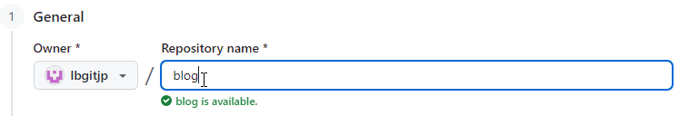

## 1. 安装Git
1. 从[git站点](https://git-scm.com/install/ "git站点") 下载并安装对应平台[git](https://git-scm.com/install/windows "git")。

## 2. 创建Github库
1. 打开[Github](https://github.com/ "Github")，创建一个Github库`blog`，个人站点将会上传到该库中。
   

2. 运行`git clone https://github.com/lbgitjp/blog.git`将Github库克隆到本地。

## 3. 在本地用Hugo生成静态站点
1. 参考上一篇帖子[建设博客站点 - 1. 在本地使用Hugo创建站点](../build-blog-1 "建设博客站点 - 1. 在本地使用Hugo创建站点")中来生成Hugo站点blog-src，本地的Hugo站点blog-src站点和上面的克隆到本地的blog库位于不同的目录中，blog库中的内容是由Hugo站点blog-src生成的。
由于要将站点发布到Github上，所以上一篇帖子中的最后两步需要按下面的步骤进行修改。

2. 修改配置文件`hugo.toml`，设置`baseURL`参数值：
`baseurl = "https://lbgitjp.github.io/blog/"`，上传的站点会托管到该地址中。

3. 打开命令行，运行`hugo`命令编译站点到`public`子目录中，这是一个静态html站点。

## 4. 将本地静态站点上传到Github库
1. 将`public`子目录中的内容都拷贝到上面克隆到本地的`blog`库中。

2. 在命令行中运行如下命令，将本地站点内容提交并上传到Github库中。
   ```bash
   # 添加修改过的所有内容到本地git库
   git add .
   # ""里面的内容就是提交内容的说明信息
   git commit -m "初始版本"
   # 将本地Git库上传到Github库
   git push
   ```

## 5. 设置Github库的GitHub Pages
1. 在Github库的[Settings](https://github.com/lbgitjp/blog/settings "Settings")导航中进入到[Pages](https://github.com/lbgitjp/blog/settings/pages "Pages")设置页，将**Build and deployment**下的**Branch**选择为`main`分支并保存设置。

2. 这时候如果打开Github库的[actions](https://github.com/lbgitjp/blog/actions "actions")页就会发现**pages build and deployment**工作流正在运行。

3. 等上面的工作流运行完成，站点就已经部署完成了，在[Pages](https://github.com/lbgitjp/blog/settings/pages "Pages")设置页中可以看到
`Your site is live at https://lbgitjp.github.io/blog/`，
打开https://lbgitjp.github.io/blog/ 就可以看到部署完成的站点。