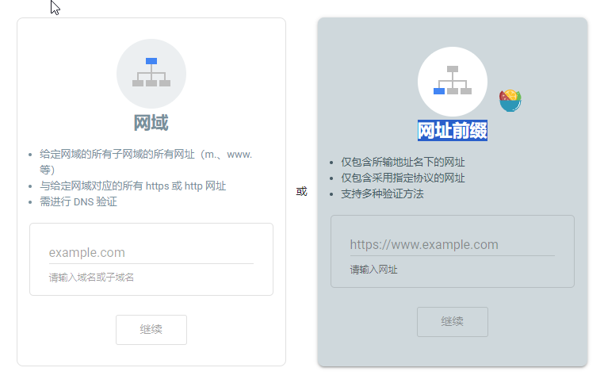
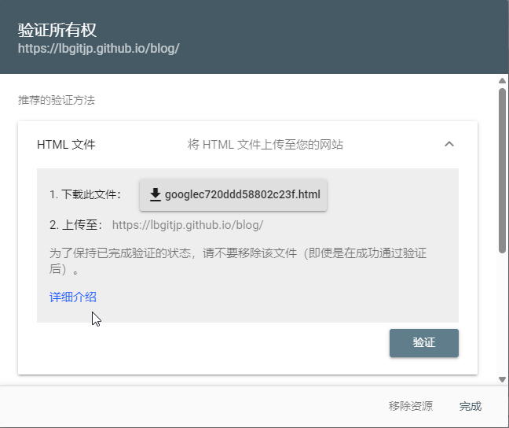
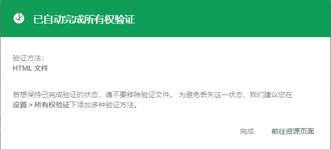

## 1. 问题
1. 当前的站点只能通过网址访问，在`Google`等搜索引擎中并不可见，需要将站点加入搜索引擎进行索引才行，下面介绍如何将站点加入`Google`搜索引擎索引。为了提高站点的可见性，应尽可能的将站点加入各个搜索引擎进行索引。

## 2. 加入Google搜索引擎
1. 需要创建一个Google账号，然后进行到[Google Search Console](https://search.google.com/search-console/welcome "Google Search Console")。

2. 选择**网址前缀**选项来添加网址，这样无论是否拥有域名的控制权都能有效。

3. 在网址文本框中输入网址[https://lbgitjp.github.io/blog/](https://lbgitjp.github.io/blog/ "https://lbgitjp.github.io/blog/")并点击“继续”按钮，会弹出**验证所有权**界面。

4. 将所有权验证文件放置在`blog`库`main`分支的`static/`目录下，即应位于`static/googlec720ddd58802c23f.html`。该目录专门用于存放静态资产（如图像、CSS文件或验证文件），`Hugo`在运行构建命令（如`hugo --minify`）时，会自动将`static/`中的内容直接复制到输出目录（默认为`public/`）的根目录中。然后`commit`提交`blog`库的`main`分支，并`push`到`Github`服务器端。

5. 等`Github`服务器端`GitHub Actions`工作流运行完成后，点击“验证”按钮，当验证通过后点击“前往资源页面”就进入到Google Search Console管理界面。

6. 在Google Search Console管理界面左侧菜单中，选择“站点地图”，然后在右侧地址中输入`sitemap.xml`，然后提交，当显示“已成功提交站点地图”后，便完成了站点地图提交，这将帮助Google了解站点结构，加速爬取和索引。

